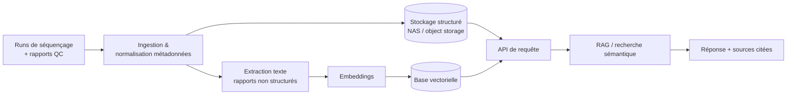

# MedSeq

**Gestion et exploration intelligente de données de séquençage pour laboratoires de génomique.**

> Statut : 🚧 en construction — MVP en cours de définition. Ce README décrit la cible du projet ; les sections marquées `[À venir]` ne sont pas encore implémentées.

---

## Le problème

Un laboratoire de séquençage (type Institut Pasteur de Dakar, plateforme DIATROPIX, CHU de Fann) génère en continu des fichiers de runs (FASTQ, BAM, VCF...), des rapports QC, et des métadonnées d'échantillons éparpillées entre plusieurs formats et emplacements. Deux frictions reviennent systématiquement :

1. **Stockage et organisation** : des téraoctets de fichiers de séquençage, versionnés à la main, avec des conventions de nommage qui varient d'un technicien à l'autre.
2. **Exploitation de l'information** : retrouver "tous les runs Klebsiella avec une qualité douteuse en 2024" ou "le rapport qui mentionne telle résistance" suppose aujourd'hui de fouiller des dossiers et des PDF à la main.

MedSeq s'attaque au second problème en priorité. Le stockage (NAS, arborescence, ingestion) est l'infrastructure qui rend le premier problème gérable, mais ce n'est pas ce qui rend le projet intéressant.

## Ce que ce projet fait (et ne fait pas)

**Fait :**
- Ingère des runs de séquençage et leurs métadonnées (échantillon, organisme, date, opérateur, statut QC) dans un stockage structuré.
- Indexe le contenu des rapports de labo (texte libre, PDF, notes QC) pour les rendre interrogeables en langage naturel.
- Répond à des questions sur le corpus de rapports et de métadonnées via une recherche sémantique / RAG — pas juste un `grep` sur des noms de fichiers.

**Ne fait pas (hors périmètre, volontairement) :**
- Pas d'analyse bioinformatique du contenu des séquences elles-mêmes (alignement, appel de variants...) — MedSeq travaille sur les *métadonnées et rapports*, pas sur les pipelines bioinfo.
- Pas de manipulation de données patients réelles. Voir [Données & éthique](#données--éthique).
- Pas un NAS générique : c'est un outil de gestion de données de labo, pas une solution de stockage grand public.

## La brique IA

C'est le cœur du projet, pas une fonctionnalité annexe.

**Recherche sémantique / RAG sur les rapports de laboratoire et les métadonnées de séquençage.**

Un utilisateur pose une question en langage naturel ("quels runs ont montré une contamination suspectée ce trimestre ?") et le système :
1. Encode la question et recherche par similarité vectorielle dans le corpus indexé (rapports QC, métadonnées structurées converties en texte, notes d'opérateurs).
2. Récupère les passages/enregistrements pertinents.
3. Génère une réponse synthétique en citant ses sources (run ID, fichier, date), pour éviter les hallucinations non traçables.

Pourquoi celle-ci et pas une autre brique candidate (classification d'organisme, détection d'anomalies QC) : elle est directement réutilisable telle quelle sur un usage réel de labo, elle est démontrable en une capture d'écran/vidéo courte, et elle est cohérente avec un profil data engineering + IA agentique (RAG, retrieval, traçabilité des sources).

`[À venir]` Détection d'anomalies sur les métriques QC des runs (score qualité, taux de duplication, profondeur de couverture) pourra être ajoutée en V2 si le temps le permet — mais volontairement pas dans le MVP.

## Architecture



## Stack technique

`[À définir / à confirmer au fil de l'implémentation]`

- **Backend** : Python (FastAPI)
- **Recherche vectorielle** : à choisir selon volumétrie (pgvector si Postgres déjà en place, sinon solution dédiée)
- **LLM / embeddings** : API Claude pour la génération, modèle d'embeddings dédié pour l'indexation
- **Stockage** : arborescence structurée + métadonnées en base relationnelle
- **Frontend** `[À venir]` : interface de requête minimaliste (recherche + réponse + sources)

## Données & éthique

Génomique + médical = données sensibles et réglementées. Ce projet est un **portfolio technique**, pas un outil déployé en production sur des données patients.

- Les données utilisées pour le développement et les démonstrations proviennent de sources publiques (NCBI, ENA) ou sont **synthétiques**, générées pour ressembler à des rapports de labo réels sans provenir de patients réels.
- Aucune donnée patient réelle n'est stockée, traitée ou exposée dans ce dépôt ni dans les démos associées.
- Si une collaboration avec un laboratoire réel (Pasteur Dakar, DIATROPIX, CHU de Fann...) devait un jour utiliser ce code sur des données réelles, cela nécessiterait un cadre éthique et réglementaire séparé (anonymisation, hébergement conforme, autorisations), hors périmètre de ce dépôt.

## Structure du repo

`[À venir — squelette prévu]`

```
medseq/
├── ingestion/        # ingestion des runs et métadonnées
├── rag/              # indexation, embeddings, pipeline RAG
├── api/              # API de requête (FastAPI)
├── data/
│   └── samples/      # jeux de données publics / synthétiques pour la démo
├── notebooks/         # exploration, prototypage
└── docs/
```

## Démarrage rapide

`[À venir dès que le MVP de la brique IA est fonctionnel]`

```bash
git clone https://github.com/JessicaNDIAYE/AI-NAS-Lab.git
cd AI-NAS-Lab
# instructions d'installation à venir
```

## Roadmap

- [ ] Définir et documenter la brique IA (RAG sur rapports + métadonnées)
- [ ] Constituer un jeu de données public/synthétique représentatif
- [ ] Pipeline d'ingestion + indexation
- [ ] API de requête RAG avec citation des sources
- [ ] Démo (vidéo courte ou interface minimale)
- [ ] `[V2]` Détection d'anomalies QC sur les runs

## Contexte

Projet portfolio réalisé en parallèle d'une expérience data engineering / IA agentique (Lizeo) et d'un projet MVP pour Fànn, pensé pour rester volontairement restreint : une brique IA solide, des données publiques, une démonstration claire — plutôt qu'un périmètre large et flou.

## Licence

`[À définir]`
